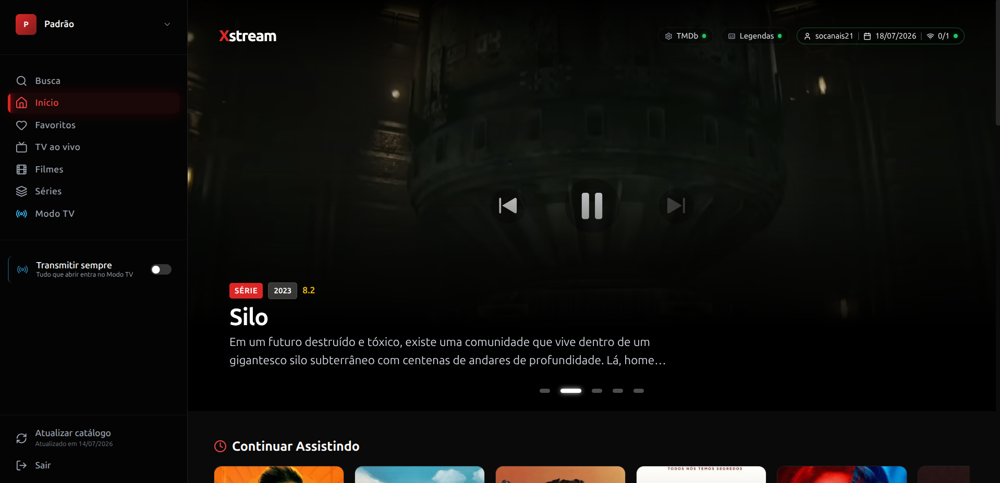

# Xstream Player



A modern web application for IPTV content playback via Xstream Codes API, built with Next.js and React.

## ⚠️ IMPORTANT SECURITY WARNING

**THIS APPLICATION IS INTENDED FOR PRIVATE NETWORK USE ONLY.**

*   **Do not expose this application directly to the internet.**
*   The application **does not have robust security checks** implemented.
*   IPTV account information (host URL, username, and password) is **saved locally unencrypted** on the server (in the `data/config.json` file).
*   Use only in controlled and secure environments is recommended.

---

## � Motivation

The idea for this project arose from the limitations found in various IPTV apps across different TV brands and devices. Some of the main problems encountered were:

*   **Repetitive Login:** The need to connect the IPTV account individually on each TV.
*   **Lack of Synchronization:** Impossible to stop watching content in the living room and continue from the exact same point in the bedroom.
*   **Poor User Experience:** Most IPTV players are filled with advertisements, require payment, or simply deliver a subpar interface.
*   **Lack of Discovery:** Absence of a dynamic experience with content suggestions based on the available library.

This project aims to solve these issues by providing a centralized, modern, and ad-free web interface.

## �📺 Features

*   Xstream Codes API Support.
*   Modern and responsive interface.
*   Local data persistence for easy access.
*   Playback of live channels, movies, and series (VOD).
*   TMDB integration for rich metadata (posters, overviews, ratings) and daily suggestions.
*   "Continue Watching" functionality to resume content from where you left off.
*   **TV Mode (connection sharing):** watch exactly what another device is broadcasting — like a live channel — sharing a **single upstream connection** (see the dedicated section below).
*   **Player quality-of-life:** on-screen title (movie / series + episode / channel) that auto-hides with the controls, and an automatic "Next episode" prompt with countdown near the end of an episode.
*   **Complete Subtitle Support:**
    *   Integration with OpenSubtitles API.
    *   **Persistence:** Automatically remembers and loads selected subtitles for each movie or episode.
    *   **Customization:** Adjust subtitle font size directly in the player (shortcuts `[` and `]`).
    *   **Accurate Matching:** Uses TMDb IDs to find the perfect subtitle for your content.

## 📡 TV Mode (Connection Sharing)

IPTV accounts have a limit of simultaneous connections. **TV Mode** lets several devices watch the same content while consuming **only one** upstream connection to your provider — the app relays a single stream to everyone, like a live TV channel.

*   **Broadcast:** while watching, enable **Transmitir** (broadcast) in the player, or turn on the global **"Transmitir tudo"** toggle in the sidebar so every content you open starts broadcasting automatically.
*   **Join:** the **Modo TV** menu lists which devices are broadcasting and what they are watching. Click one to join its stream — **without opening a new connection**. When you hit the account's connection limit, a modal also offers the active broadcasts to join.
*   **Works for live channels, movies, and series.** Live channels are relayed directly; movies and episodes (VOD) are turned into a live-style stream with **ffmpeg**, so joiners tune into the current position (channel-style, no independent seek).
*   **Time sync:** when the broadcaster and viewers drift apart, a **"Sincronizar"** button appears. A viewer jumps to the broadcaster's position; the broadcaster can pull everyone to its own time. The button only shows up when players are actually out of sync.
*   **Auto device naming:** devices are labeled from their user agent (e.g. "Smart TV (LG)", "iPhone", "PC (Windows)") and can be renamed in the Modo TV screen.

> **Requirements:** sharing movies/series (VOD) needs **ffmpeg** installed on the server. The provided Docker image already includes it. Shared state lives in the `data/` folder (`tv-mode.sqlite`), so it works even across multiple app instances that share that folder.

## 📱 Installable TV Client (webOS / Tizen)

Besides opening the app in the TV's browser, there is an **installable client** for LG webOS and Samsung Tizen. It holds no catalog and no credentials: it finds your server on the network, gets authorized, and hands over to it — so it has every feature the web app has.

*   **Server address:** on first run the TV asks for the server's IP or host (e.g. `192.168.0.10:3000`) and tests the connection before continuing.
*   **Pairing by code:** the TV shows a 6-character code. On your computer, open **Dispositivos** in the app, type the code and approve it, naming the device and picking its default profile. Nothing else is typed on the remote.
*   **Revocable:** every paired device is listed with its last access and can be renamed or revoked at any time. A revoked TV loses access immediately.
*   **Replicable:** the same payload ships as a `.ipk` (webOS), a `.wgt` (Tizen), or inside an Android TV WebView — only the manifest differs.

```bash
npm run tv:assets       # icon + splash
npm run package:webos   # → tv/dist/*.ipk
npm run package:tizen   # → tv/dist/*.wgt
```

See [`docs/tv-client.md`](docs/tv-client.md) for installing over Developer Mode and what publishing to the LG Content Store actually requires.

## 🚀 How to Install and Run

### Prerequisites

*   Node.js (v18 or higher)
*   npm or yarn
*   **ffmpeg** (optional — only required to broadcast movies/series in TV Mode; already bundled in the Docker image)

### Local Installation

1.  Clone the repository or download the files.
2.  In the terminal, access the project folder.
3.  Install dependencies:
    ```bash
    npm install
    ```
4.  Start the development server:
    ```bash
    npm run dev
    ```
5.  Access `http://localhost:3000` in your browser.

### Docker

1.  Build the image:
    ```bash
    docker build -t xstream-player .
    ```

2.  Run the container with data persistence (essential for saving login):
    ```bash
    docker run -d \
      -p 3000:3000 \
      -v $(pwd)/data:/app/data \
      --name xstream-player \
      xstream-player
    ```

    Or if you prefer to use the Docker Hub image (if available):
    ```bash
    docker run -d \
      -p 3000:3000 \
      -v $(pwd)/data:/app/data \
      --name xstream-player \
      jandersonss/xstream-player:latest
    ```

## 💾 Data Persistence

The application uses the `/data` folder in the project root to store logged-in account settings (`config.json`).

It is **essential** to bind this volume (`-v $(pwd)/data:/app/data`) to ensure your login data remains persistent after container restart.

### Docker Compose

Example `docker-compose.yml`:
```yaml
services:
  xstream-player:
    image: xstream-player
    build: .
    ports:
      - "3000:3000"
    volumes:
      - ./data:/app/data
```

### ⚠️ Important (Linux Users)

If you are running on Linux, you may face permission issues (`EACCES: permission denied`), as the container user (`uid 1001`) is different from your local user.

To fix this, you need to adjust permissions for the `data` folder on your local machine:

```bash
# Option 1: Give write permission to "others" (easier)
chmod -R 777 data/

# Option 2: Assign ownership to the container uid (more secure)
sudo chown -R 1001:1001 data/
```

## 🛠️ Technologies Used

*   [Next.js](https://nextjs.org/)
*   [React](https://reactjs.org/)
*   [Tailwind CSS](https://tailwindcss.com/)
*   [HLS.js](https://github.com/video-dev/hls.js/)
*   [ffmpeg](https://ffmpeg.org/) (VOD connection sharing in TV Mode)
*   [Framer Motion](https://www.framer.com/motion/)
*   [Lucide React](https://lucide.dev/)

---

## 🤝 Contributing

Contributions are welcome. Before opening a pull request, please read the
[Contributor License Agreement](CLA.md) and include the acceptance statement described
there in your PR description — this lets the project keep its licensing options open.

## 📄 License

Copyright (C) 2026 Janderson Lemos.

Xstream Player is free software, licensed under the
**[GNU Affero General Public License v3.0](LICENSE)**.

You may use, study, share, and modify it. If you distribute it — or run a modified
version as a network service — you must make the complete corresponding source code
available to your users under the same license.

### ⚠️ Third-party dependencies

The npm dependencies are permissively licensed (MIT / Apache-2.0) and impose no
restrictions beyond attribution.

**ffmpeg is the exception.** It is licensed under the GPL/LGPL and is bundled into the
Docker image to support VOD in TV Mode. It runs as an external binary (invoked as a
subprocess, not linked), so it does not affect the license of this project's own code —
but **anyone who redistributes the Docker image is also redistributing ffmpeg** and must
comply with the GPL for that binary (provide its source, keep its license notices).

This is a non-issue while the project is distributed under the AGPL. It only needs to be
addressed if the image is ever shipped as part of a closed-source or commercial product —
in that case, either comply with ffmpeg's GPL obligations for the bundled binary, or stop
bundling it and require the user to install ffmpeg themselves.

---

## Donations

**In cryptocurrencies:**

**EVM Networks (ETH, BNB, Arbitrum, Optimism, etc.):**
`0x67270c1e57bdcc888331198e79f001de7b8a7e88`

**Solana:**
`4q4LufXBtvvRo4Rc3YfJMhXwagkqiwzJmBbYkZWrJ4ja`

**BTC:** `bc1qz6kjajch0efkc827sal0mncvzam6njjqsfjh3q`

**Pix:** `2e204859-2190-4147-b97f-6d141cbdf324`
